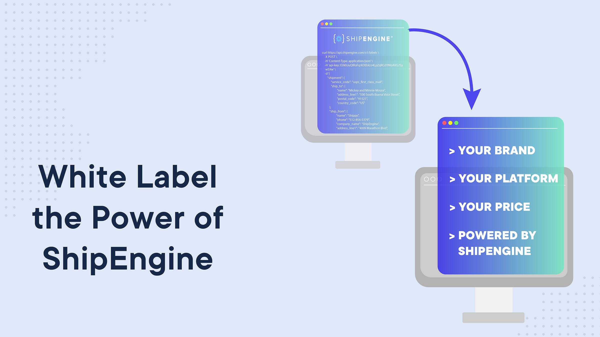

<div align="left">

[](https://shipengine.com)

# [Shipengine](https://shipengine.com)

ShipEngine's easy-to-use REST API lets you manage all of your shipping needs without worrying about the complexities of different carrier APIs and protocols. We handle all the heavy lifting so you can focus on providing a first-class shipping experience for your customers at the best possible prices.

Each of ShipEngine's features can be used by itself or in conjunction with each other to build powerful shipping functionality into your application or service.

## Getting Started
If you're new to REST APIs then be sure to read our [introduction to REST](https://www.shipengine.com/docs/rest/) to understand the basics.  Learn how to [authenticate yourself to ShipEngine](https://www.shipengine.com/docs/auth/), and then use our [sandbox environment](https://www.shipengine.com/docs/sandbox/) to kick the tires and get familiar with our API. If you run into any problems, then be sure to check the [error handling guide](https://www.shipengine.com/docs/errors/) for tips.

Here are some step-by-step **tutorials** to get you started:

  - [Learn how to create your first shipping label](https://www.shipengine.com/docs/labels/create-a-label/)
  - [Calculate shipping costs and compare rates across carriers](https://www.shipengine.com/docs/rates/)
  - [Track packages on-demand or in real time](https://www.shipengine.com/docs/tracking/)
  - [Validate mailing addresses anywhere on Earth](https://www.shipengine.com/docs/addresses/validation/)


## Shipping Labels for Every Major Carrier
ShipEngine makes it easy to [create shipping labels for any carrier](https://www.shipengine.com/docs/labels/create-a-label/) and [download them](https://www.shipengine.com/docs/labels/downloading/) in a [variety of file formats](https://www.shipengine.com/docs/labels/formats/). You can even customize labels with your own [messages](https://www.shipengine.com/docs/labels/messages/) and [images](https://www.shipengine.com/docs/labels/branding/).


## Real-Time Package Tracking
With ShipEngine you can [get the current status of a package](https://www.shipengine.com/docs/tracking/) or [subscribe to real-time tracking updates](https://www.shipengine.com/docs/tracking/webhooks/) via webhooks. You can also create [custimized tracking pages](https://www.shipengine.com/docs/tracking/branded-tracking-page/) with your own branding so your customers will always know where their package is.


## Compare Shipping Costs Across Carriers
Make sure you ship as cost-effectively as possible by [comparing rates across carriers](https://www.shipengine.com/docs/rates/get-shipment-rates/) using the ShipEngine Rates API. Or if you don't know the full shipment details yet, then you can [get rate estimates](https://www.shipengine.com/docs/rates/estimate/) with limited address info.


## Worldwide Address Validation
ShipEngine supports [address validation](https://www.shipengine.com/docs/addresses/validation/) for virtually [every country on Earth](https://www.shipengine.com/docs/addresses/validation/countries/), including the United States, Canada, Great Britain, Australia, Germany, France, Norway, Spain, Sweden, Israel, Italy, and over 160 others.


</div>

## Requirements

Building the API client library requires:

1. Java 1.8+
2. Maven (3.8.3+)/Gradle (7.2+)

If you are adding this library to an Android Application or Library:

3. Android 8.0+ (API Level 26+)

## Installation<a id="installation"></a>
<div align="center">
  <a href="https://konfigthis.com/sdk-sign-up?company=ShipEngine&language=Java">
    
  </a>
</div>

### Maven users

Add this dependency to your project's POM:

```xml
<dependency>
  <groupId>com.konfigthis</groupId>
  <artifactId>ship-engine-java-sdk</artifactId>
  <version>1.1.202403202303</version>
  <scope>compile</scope>
</dependency>
```

### Gradle users

Add this dependency to your `build.gradle`:

```groovy
// build.gradle
repositories {
  mavenCentral()
}

dependencies {
   implementation "com.konfigthis:ship-engine-java-sdk:1.1.202403202303"
}
```

### Android users

Make sure your `build.gradle` file as a `minSdk` version of at least 26:
```groovy
// build.gradle
android {
    defaultConfig {
        minSdk 26
    }
}
```

Also make sure your library or application has internet permissions in your `AndroidManifest.xml`:

```xml
<!--AndroidManifest.xml-->
<?xml version="1.0" encoding="utf-8"?>
<manifest xmlns:android="http://schemas.android.com/apk/res/android"
    xmlns:tools="http://schemas.android.com/tools">
    <uses-permission android:name="android.permission.INTERNET"/>
</manifest>
```

### Others

At first generate the JAR by executing:

```shell
mvn clean package
```

Then manually install the following JARs:

* `target/ship-engine-java-sdk-1.1.202403202303.jar`
* `target/lib/*.jar`

## Getting Started

Please follow the [installation](#installation) instruction and execute the following Java code:

```java
import com.konfigthis.client.ApiClient;
import com.konfigthis.client.ApiException;
import com.konfigthis.client.ApiResponse;
import com.konfigthis.client.ShipEngine;
import com.konfigthis.client.Configuration;
import com.konfigthis.client.auth.*;
import com.konfigthis.client.model.*;
import com.konfigthis.client.api.AccountApi;
import java.util.List;
import java.util.Map;
import java.util.UUID;

public class Example {
  public static void main(String[] args) {
    Configuration configuration = new Configuration();
    configuration.host = "https://api.shipengine.com";
    
    configuration.apiKey  = "YOUR API KEY";
    ShipEngine client = new ShipEngine(configuration);
    String labelImageId = "labelImageId_example"; // Used to identify an image resource.
    String name = "name_example"; // A human readable name for the image. 
    Boolean isDefault = true; // Indicates whether this image is set as default. 
    String imageContentType = "image/png"; // The image type
    String imageData = "imageData_example"; // A base64 encoded string representation of the image. 
    OffsetDateTime createdAt = OffsetDateTime.now(); // An [ISO 8601](https://en.wikipedia.org/wiki/ISO_8601) string that represents a date and time. 
    OffsetDateTime modifiedAt = OffsetDateTime.now(); // An [ISO 8601](https://en.wikipedia.org/wiki/ISO_8601) string that represents a date and time. 
    try {
      AccountSettingsImages result = client
              .account
              .createImage()
              .labelImageId(labelImageId)
              .name(name)
              .isDefault(isDefault)
              .imageContentType(imageContentType)
              .imageData(imageData)
              .createdAt(createdAt)
              .modifiedAt(modifiedAt)
              .execute();
      System.out.println(result);
      System.out.println(result.getLabelImageId());
      System.out.println(result.getName());
      System.out.println(result.getIsDefault());
      System.out.println(result.getImageContentType());
      System.out.println(result.getImageData());
      System.out.println(result.getCreatedAt());
      System.out.println(result.getModifiedAt());
    } catch (ApiException e) {
      System.err.println("Exception when calling AccountApi#createImage");
      System.err.println("Status code: " + e.getStatusCode());
      System.err.println("Reason: " + e.getResponseBody());
      System.err.println("Response headers: " + e.getResponseHeaders());
      e.printStackTrace();
    }

    // Use .executeWithHttpInfo() to retrieve HTTP Status Code, Headers and Request
    try {
      ApiResponse<AccountSettingsImages> response = client
              .account
              .createImage()
              .labelImageId(labelImageId)
              .name(name)
              .isDefault(isDefault)
              .imageContentType(imageContentType)
              .imageData(imageData)
              .createdAt(createdAt)
              .modifiedAt(modifiedAt)
              .executeWithHttpInfo();
      System.out.println(response.getResponseBody());
      System.out.println(response.getResponseHeaders());
      System.out.println(response.getStatusCode());
      System.out.println(response.getRoundTripTime());
      System.out.println(response.getRequest());
    } catch (ApiException e) {
      System.err.println("Exception when calling AccountApi#createImage");
      System.err.println("Status code: " + e.getStatusCode());
      System.err.println("Reason: " + e.getResponseBody());
      System.err.println("Response headers: " + e.getResponseHeaders());
      e.printStackTrace();
    }
  }
}

```

## Documentation for API Endpoints

All URIs are relative to *https://api.shipengine.com*

Class | Method | HTTP request | Description
------------ | ------------- | ------------- | -------------
*AccountApi* | [**createImage**](docs/AccountApi.md#createImage) | **POST** /v1/account/settings/images | Create an Account Image
*AccountApi* | [**deleteImageById**](docs/AccountApi.md#deleteImageById) | **DELETE** /v1/account/settings/images/{label_image_id} | Delete Account Image By Id
*AccountApi* | [**getImageById**](docs/AccountApi.md#getImageById) | **GET** /v1/account/settings/images/{label_image_id} | Get Account Image By ID
*AccountApi* | [**listImages**](docs/AccountApi.md#listImages) | **GET** /v1/account/settings/images | List Account Images
*AccountApi* | [**listSettings**](docs/AccountApi.md#listSettings) | **GET** /v1/account/settings | List Account Settings
*AccountApi* | [**updateImageById**](docs/AccountApi.md#updateImageById) | **PUT** /v1/account/settings/images/{label_image_id} | Update Account Image By ID
*AddressesApi* | [**address**](docs/AddressesApi.md#address) | **PUT** /v1/addresses/recognize | Parse an address
*AddressesApi* | [**address_0**](docs/AddressesApi.md#address_0) | **POST** /v1/addresses/validate | Validate An Address
*BatchesApi* | [**addToBatch**](docs/BatchesApi.md#addToBatch) | **POST** /v1/batches/{batch_id}/add | Add to a Batch
*BatchesApi* | [**batch**](docs/BatchesApi.md#batch) | **POST** /v1/batches | Create A Batch
*BatchesApi* | [**batch_0**](docs/BatchesApi.md#batch_0) | **PUT** /v1/batches/{batch_id} | Update Batch By Id
*BatchesApi* | [**batch_1**](docs/BatchesApi.md#batch_1) | **DELETE** /v1/batches/{batch_id} | Delete Batch By Id
*BatchesApi* | [**batch_2**](docs/BatchesApi.md#batch_2) | **POST** /v1/batches/{batch_id}/process/labels | Process Batch ID Labels
*BatchesApi* | [**batches**](docs/BatchesApi.md#batches) | **GET** /v1/batches | List Batches
*BatchesApi* | [**getByExternalId**](docs/BatchesApi.md#getByExternalId) | **GET** /v1/batches/external_batch_id/{external_batch_id} | Get Batch By External ID
*BatchesApi* | [**getById**](docs/BatchesApi.md#getById) | **GET** /v1/batches/{batch_id} | Get Batch By ID
*BatchesApi* | [**getErrors**](docs/BatchesApi.md#getErrors) | **GET** /v1/batches/{batch_id}/errors | Get Batch Errors
*BatchesApi* | [**removeFromBatch**](docs/BatchesApi.md#removeFromBatch) | **POST** /v1/batches/{batch_id}/remove | Remove From Batch
*CarrierAccountsApi* | [**carrier**](docs/CarrierAccountsApi.md#carrier) | **POST** /v1/connections/carriers/{carrier_name} | Connect a carrier account
*CarrierAccountsApi* | [**carrier_0**](docs/CarrierAccountsApi.md#carrier_0) | **DELETE** /v1/connections/carriers/{carrier_name}/{carrier_id} | Disconnect a carrier
*CarrierAccountsApi* | [**getSettings**](docs/CarrierAccountsApi.md#getSettings) | **GET** /v1/connections/carriers/{carrier_name}/{carrier_id}/settings | Get carrier settings
*CarrierAccountsApi* | [**updateSettings**](docs/CarrierAccountsApi.md#updateSettings) | **PUT** /v1/connections/carriers/{carrier_name}/{carrier_id}/settings | Update carrier settings
*CarriersApi* | [**addFundsToCarrier**](docs/CarriersApi.md#addFundsToCarrier) | **PUT** /v1/carriers/{carrier_id}/add_funds | Add Funds To Carrier
*CarriersApi* | [**carriers**](docs/CarriersApi.md#carriers) | **GET** /v1/carriers | List Carriers
*CarriersApi* | [**disconnectById**](docs/CarriersApi.md#disconnectById) | **DELETE** /v1/carriers/{carrier_id} | Disconnect Carrier by ID
*CarriersApi* | [**getById**](docs/CarriersApi.md#getById) | **GET** /v1/carriers/{carrier_id} | Get Carrier By ID
*CarriersApi* | [**getOptions**](docs/CarriersApi.md#getOptions) | **GET** /v1/carriers/{carrier_id}/options | Get Carrier Options
*CarriersApi* | [**listPackageTypes**](docs/CarriersApi.md#listPackageTypes) | **GET** /v1/carriers/{carrier_id}/packages | List Carrier Package Types
*CarriersApi* | [**listServices**](docs/CarriersApi.md#listServices) | **GET** /v1/carriers/{carrier_id}/services | List Carrier Services
*DownloadsApi* | [**callFile**](docs/DownloadsApi.md#callFile) | **GET** /v1/downloads/{dir}/{subdir}/{filename} | Download File
*InsuranceApi* | [**autoFundAccount**](docs/InsuranceApi.md#autoFundAccount) | **PATCH** /v1/insurance/shipsurance/add_funds | Add Funds To Insurance
*InsuranceApi* | [**getFundsBalance**](docs/InsuranceApi.md#getFundsBalance) | **GET** /v1/insurance/shipsurance/balance | Get Insurance Funds Balance
*InsuranceApi* | [**insurer**](docs/InsuranceApi.md#insurer) | **POST** /v1/connections/insurance/shipsurance | Connect a Shipsurance Account
*InsuranceApi* | [**insurer_0**](docs/InsuranceApi.md#insurer_0) | **DELETE** /v1/connections/insurance/shipsurance | Disconnect a Shipsurance Account
*LabelsApi* | [**createReturnLabel**](docs/LabelsApi.md#createReturnLabel) | **POST** /v1/labels/{label_id}/return | Create a return label
*LabelsApi* | [**getByExternalShipmentId**](docs/LabelsApi.md#getByExternalShipmentId) | **GET** /v1/labels/external_shipment_id/{external_shipment_id} | Get Label By External Shipment ID
*LabelsApi* | [**getById**](docs/LabelsApi.md#getById) | **GET** /v1/labels/{label_id} | Get Label By ID
*LabelsApi* | [**getTrackingInfo**](docs/LabelsApi.md#getTrackingInfo) | **GET** /v1/labels/{label_id}/track | Get Label Tracking Information
*LabelsApi* | [**label**](docs/LabelsApi.md#label) | **POST** /v1/labels | Purchase Label
*LabelsApi* | [**label_0**](docs/LabelsApi.md#label_0) | **PUT** /v1/labels/{label_id}/void | Void a Label By ID
*LabelsApi* | [**labels**](docs/LabelsApi.md#labels) | **GET** /v1/labels | List labels
*LabelsApi* | [**purchaseLabelWithRateId**](docs/LabelsApi.md#purchaseLabelWithRateId) | **POST** /v1/labels/rates/{rate_id} | Purchase Label with Rate ID
*LabelsApi* | [**purchaseLabelWithShipmentId**](docs/LabelsApi.md#purchaseLabelWithShipmentId) | **POST** /v1/labels/shipment/{shipment_id} | Purchase Label with Shipment ID
*ManifestsApi* | [**getById**](docs/ManifestsApi.md#getById) | **GET** /v1/manifests/{manifest_id} | Get Manifest By Id
*ManifestsApi* | [**getRequestById**](docs/ManifestsApi.md#getRequestById) | **GET** /v1/manifests/requests/{manifest_request_id} | Get Manifest Request By Id
*ManifestsApi* | [**manifest**](docs/ManifestsApi.md#manifest) | **POST** /v1/manifests | Create Manifest
*ManifestsApi* | [**manifests**](docs/ManifestsApi.md#manifests) | **GET** /v1/manifests | List Manifests
*PackagePickupsApi* | [**getById**](docs/PackagePickupsApi.md#getById) | **GET** /v1/pickups/{pickup_id} | Get Pickup By ID
*PackagePickupsApi* | [**listScheduledPickups**](docs/PackagePickupsApi.md#listScheduledPickups) | **GET** /v1/pickups | List Scheduled Pickups
*PackagePickupsApi* | [**pickup**](docs/PackagePickupsApi.md#pickup) | **POST** /v1/pickups | Schedule a Pickup
*PackagePickupsApi* | [**removeScheduledPickup**](docs/PackagePickupsApi.md#removeScheduledPickup) | **DELETE** /v1/pickups/{pickup_id} | Delete a Scheduled Pickup
*PackageTypesApi* | [**createCustomPackageType**](docs/PackageTypesApi.md#createCustomPackageType) | **POST** /v1/packages | Create Custom Package Type
*PackageTypesApi* | [**deleteCustomPackageById**](docs/PackageTypesApi.md#deleteCustomPackageById) | **DELETE** /v1/packages/{package_id} | Delete A Custom Package By ID
*PackageTypesApi* | [**getById**](docs/PackageTypesApi.md#getById) | **GET** /v1/packages/{package_id} | Get Custom Package Type By ID
*PackageTypesApi* | [**listCustomPackageTypes**](docs/PackageTypesApi.md#listCustomPackageTypes) | **GET** /v1/packages | List Custom Package Types
*PackageTypesApi* | [**updateCustomPackageTypeById**](docs/PackageTypesApi.md#updateCustomPackageTypeById) | **PUT** /v1/packages/{package_id} | Update Custom Package Type By ID
*RatesApi* | [**getBulkShipmentRates**](docs/RatesApi.md#getBulkShipmentRates) | **POST** /v1/rates/bulk | Get Bulk Rates
*RatesApi* | [**getById**](docs/RatesApi.md#getById) | **GET** /v1/rates/{rate_id} | Get Rate By ID
*RatesApi* | [**rates**](docs/RatesApi.md#rates) | **POST** /v1/rates | Get Shipping Rates
*RatesApi* | [**rates_0**](docs/RatesApi.md#rates_0) | **POST** /v1/rates/estimate | Estimate Rates
*ServicePointsApi* | [**getById**](docs/ServicePointsApi.md#getById) | **GET** /v1/service_points/{carrier_code}/{country_code}/{service_point_id} | Get Service Point By ID
*ServicePointsApi* | [**getByLocation**](docs/ServicePointsApi.md#getByLocation) | **POST** /v1/service_points/list | List Service Points
*ShipmentsApi* | [**getByExternalId**](docs/ShipmentsApi.md#getByExternalId) | **GET** /v1/shipments/external_shipment_id/{external_shipment_id} | Get Shipment By External ID
*ShipmentsApi* | [**getById**](docs/ShipmentsApi.md#getById) | **GET** /v1/shipments/{shipment_id} | Get Shipment By ID
*ShipmentsApi* | [**getRatesForShipment**](docs/ShipmentsApi.md#getRatesForShipment) | **GET** /v1/shipments/{shipment_id}/rates | Get Shipment Rates
*ShipmentsApi* | [**getTagsById**](docs/ShipmentsApi.md#getTagsById) | **GET** /v1/shipments/{shipment_id}/tags | Get Shipment Tags
*ShipmentsApi* | [**shipment**](docs/ShipmentsApi.md#shipment) | **PUT** /v1/shipments/recognize | Parse shipping info
*ShipmentsApi* | [**shipment_0**](docs/ShipmentsApi.md#shipment_0) | **PUT** /v1/shipments/{shipment_id} | Update Shipment By ID
*ShipmentsApi* | [**shipment_1**](docs/ShipmentsApi.md#shipment_1) | **POST** /v1/shipments/{shipment_id}/tags/{tag_name} | Add Tag to Shipment
*ShipmentsApi* | [**shipment_2**](docs/ShipmentsApi.md#shipment_2) | **DELETE** /v1/shipments/{shipment_id}/tags/{tag_name} | Remove Tag from Shipment
*ShipmentsApi* | [**shipments**](docs/ShipmentsApi.md#shipments) | **GET** /v1/shipments | List Shipments
*ShipmentsApi* | [**shipments_0**](docs/ShipmentsApi.md#shipments_0) | **POST** /v1/shipments | Create Shipments
*ShipmentsApi* | [**shipments_1**](docs/ShipmentsApi.md#shipments_1) | **PUT** /v1/shipments/{shipment_id}/cancel | Cancel a Shipment
*ShipmentsApi* | [**updateTags**](docs/ShipmentsApi.md#updateTags) | **PUT** /v1/shipments/tags | Update Shipments Tags
*TagsApi* | [**tag**](docs/TagsApi.md#tag) | **POST** /v1/tags/{tag_name} | Create a New Tag
*TagsApi* | [**tag_0**](docs/TagsApi.md#tag_0) | **DELETE** /v1/tags/{tag_name} | Delete Tag
*TagsApi* | [**tag_1**](docs/TagsApi.md#tag_1) | **PUT** /v1/tags/{tag_name}/{new_tag_name} | Update Tag Name
*TagsApi* | [**tags**](docs/TagsApi.md#tags) | **GET** /v1/tags | Get Tags
*TokensApi* | [**generateEphemeralToken**](docs/TokensApi.md#generateEphemeralToken) | **POST** /v1/tokens/ephemeral | Get Ephemeral Token
*TrackingApi* | [**infoRetrieval**](docs/TrackingApi.md#infoRetrieval) | **GET** /v1/tracking | Get Tracking Information
*TrackingApi* | [**tracking**](docs/TrackingApi.md#tracking) | **POST** /v1/tracking/start | Start Tracking a Package
*TrackingApi* | [**tracking_0**](docs/TrackingApi.md#tracking_0) | **POST** /v1/tracking/stop | Stop Tracking a Package
*WarehousesApi* | [**getById**](docs/WarehousesApi.md#getById) | **GET** /v1/warehouses/{warehouse_id} | Get Warehouse By Id
*WarehousesApi* | [**updateSettings**](docs/WarehousesApi.md#updateSettings) | **PUT** /v1/warehouses/{warehouse_id}/settings | Update Warehouse Settings
*WarehousesApi* | [**warehouse**](docs/WarehousesApi.md#warehouse) | **POST** /v1/warehouses | Create Warehouse
*WarehousesApi* | [**warehouse_0**](docs/WarehousesApi.md#warehouse_0) | **PUT** /v1/warehouses/{warehouse_id} | Update Warehouse By Id
*WarehousesApi* | [**warehouse_1**](docs/WarehousesApi.md#warehouse_1) | **DELETE** /v1/warehouses/{warehouse_id} | Delete Warehouse By ID
*WarehousesApi* | [**warehouses**](docs/WarehousesApi.md#warehouses) | **GET** /v1/warehouses | List Warehouses
*WebhooksApi* | [**getById**](docs/WebhooksApi.md#getById) | **GET** /v1/environment/webhooks/{webhook_id} | Get Webhook By ID
*WebhooksApi* | [**webhook**](docs/WebhooksApi.md#webhook) | **POST** /v1/environment/webhooks | Create a Webhook
*WebhooksApi* | [**webhook_0**](docs/WebhooksApi.md#webhook_0) | **PUT** /v1/environment/webhooks/{webhook_id} | Update a Webhook
*WebhooksApi* | [**webhook_1**](docs/WebhooksApi.md#webhook_1) | **DELETE** /v1/environment/webhooks/{webhook_id} | Delete Webhook By ID
*WebhooksApi* | [**webhooks**](docs/WebhooksApi.md#webhooks) | **GET** /v1/environment/webhooks | List Webhooks


## Documentation for Models

 - [AccountSettings](docs/AccountSettings.md)
 - [AccountSettingsImages](docs/AccountSettingsImages.md)
 - [AddFundsToCarrierResponseBody](docs/AddFundsToCarrierResponseBody.md)
 - [AddressResidentialIndicator](docs/AddressResidentialIndicator.md)
 - [AddressValidatingShipment](docs/AddressValidatingShipment.md)
 - [AddressValidationCode](docs/AddressValidationCode.md)
 - [AddressValidationDetailCode](docs/AddressValidationDetailCode.md)
 - [AddressValidationDetailCodeNullable](docs/AddressValidationDetailCodeNullable.md)
 - [AddressValidationMessageType](docs/AddressValidationMessageType.md)
 - [AddressValidationResult](docs/AddressValidationResult.md)
 - [AddressValidationStatus](docs/AddressValidationStatus.md)
 - [AdvancedShipmentOptions](docs/AdvancedShipmentOptions.md)
 - [AdvancedShipmentOptionsDangerousGoodsContact](docs/AdvancedShipmentOptionsDangerousGoodsContact.md)
 - [AdvancedShipmentOptionsFedexFreight](docs/AdvancedShipmentOptionsFedexFreight.md)
 - [AllowedIncoterms](docs/AllowedIncoterms.md)
 - [AlternativeIdentifier](docs/AlternativeIdentifier.md)
 - [AlternativeIdentifiers](docs/AlternativeIdentifiers.md)
 - [AncillaryServiceEndorsement](docs/AncillaryServiceEndorsement.md)
 - [Batch](docs/Batch.md)
 - [BatchResponseError](docs/BatchResponseError.md)
 - [BatchStatus](docs/BatchStatus.md)
 - [BatchesSortBy](docs/BatchesSortBy.md)
 - [BillToParty](docs/BillToParty.md)
 - [BillToPartyNullable](docs/BillToPartyNullable.md)
 - [BulkRate](docs/BulkRate.md)
 - [CalculateRatesResponseBody](docs/CalculateRatesResponseBody.md)
 - [Carrier](docs/Carrier.md)
 - [CarrierAdvancedOption](docs/CarrierAdvancedOption.md)
 - [CarrierName](docs/CarrierName.md)
 - [CarrierNameWithSettings](docs/CarrierNameWithSettings.md)
 - [CollectOnDelivery](docs/CollectOnDelivery.md)
 - [CollectOnDeliveryPaymentType](docs/CollectOnDeliveryPaymentType.md)
 - [ConnectAccessWorldwideRequestBody](docs/ConnectAccessWorldwideRequestBody.md)
 - [ConnectAmazonBuyShippingRequestBody](docs/ConnectAmazonBuyShippingRequestBody.md)
 - [ConnectAmazonShippingUk](docs/ConnectAmazonShippingUk.md)
 - [ConnectApcRequestBody](docs/ConnectApcRequestBody.md)
 - [ConnectAsendiaRequestBody](docs/ConnectAsendiaRequestBody.md)
 - [ConnectAustraliaPostRequestBody](docs/ConnectAustraliaPostRequestBody.md)
 - [ConnectCanadaPostRequestBody](docs/ConnectCanadaPostRequestBody.md)
 - [ConnectCarrierResponseBody](docs/ConnectCarrierResponseBody.md)
 - [ConnectDhlEcommerceRequestBody](docs/ConnectDhlEcommerceRequestBody.md)
 - [ConnectDhlExpressAuRequestBody](docs/ConnectDhlExpressAuRequestBody.md)
 - [ConnectDhlExpressCaRequestBody](docs/ConnectDhlExpressCaRequestBody.md)
 - [ConnectDhlExpressRequestBody](docs/ConnectDhlExpressRequestBody.md)
 - [ConnectDhlExpressUkRequestBody](docs/ConnectDhlExpressUkRequestBody.md)
 - [ConnectDpdRequestBody](docs/ConnectDpdRequestBody.md)
 - [ConnectEndiciaRequestBody](docs/ConnectEndiciaRequestBody.md)
 - [ConnectFedexRequestBody](docs/ConnectFedexRequestBody.md)
 - [ConnectFedexUkRequestBody](docs/ConnectFedexUkRequestBody.md)
 - [ConnectFirstmileRequestBody](docs/ConnectFirstmileRequestBody.md)
 - [ConnectImexRequestBody](docs/ConnectImexRequestBody.md)
 - [ConnectInsurerRequestBody](docs/ConnectInsurerRequestBody.md)
 - [ConnectNewgisticsRequestBody](docs/ConnectNewgisticsRequestBody.md)
 - [ConnectOntracRequestBody](docs/ConnectOntracRequestBody.md)
 - [ConnectPurolatorRequestBody](docs/ConnectPurolatorRequestBody.md)
 - [ConnectRoyalMailRequestBody](docs/ConnectRoyalMailRequestBody.md)
 - [ConnectRrDonnelleyRequestBody](docs/ConnectRrDonnelleyRequestBody.md)
 - [ConnectSekoRequestBody](docs/ConnectSekoRequestBody.md)
 - [ConnectSendleRequestBody](docs/ConnectSendleRequestBody.md)
 - [ConnectStampsRequestBody](docs/ConnectStampsRequestBody.md)
 - [ConnectUpsRequestBody](docs/ConnectUpsRequestBody.md)
 - [ContactDetails](docs/ContactDetails.md)
 - [CreateAndProcessBatchRequestBody](docs/CreateAndProcessBatchRequestBody.md)
 - [CreateAndProcessBatchRequestBodyProcessLabels](docs/CreateAndProcessBatchRequestBodyProcessLabels.md)
 - [CreateAndValidateShipment](docs/CreateAndValidateShipment.md)
 - [CreateBatchRequestBody](docs/CreateBatchRequestBody.md)
 - [CreateLabelFromShipmentRequestBody](docs/CreateLabelFromShipmentRequestBody.md)
 - [CreateManifestByObjectRequestBody](docs/CreateManifestByObjectRequestBody.md)
 - [CreateManifestLabelIdsRequestBody](docs/CreateManifestLabelIdsRequestBody.md)
 - [CreateManifestResponseBody](docs/CreateManifestResponseBody.md)
 - [CreateReturnLabelRequestBody](docs/CreateReturnLabelRequestBody.md)
 - [CreateShipmentResponseBodyFields](docs/CreateShipmentResponseBodyFields.md)
 - [CreateShipmentsRequestBody](docs/CreateShipmentsRequestBody.md)
 - [CreateShipmentsResponseBody](docs/CreateShipmentsResponseBody.md)
 - [CreateWebhookRequestBody](docs/CreateWebhookRequestBody.md)
 - [CustomsItem](docs/CustomsItem.md)
 - [DangerousAmount](docs/DangerousAmount.md)
 - [DangerousGoods](docs/DangerousGoods.md)
 - [DefaultLabelLayout](docs/DefaultLabelLayout.md)
 - [DeletePickupByIdResponseBody](docs/DeletePickupByIdResponseBody.md)
 - [DeleteScheduledPickupResponseBody](docs/DeleteScheduledPickupResponseBody.md)
 - [DeliveryConfirmation](docs/DeliveryConfirmation.md)
 - [DeprecatedManifest](docs/DeprecatedManifest.md)
 - [DhlExpressAccountSettings](docs/DhlExpressAccountSettings.md)
 - [DimensionUnit](docs/DimensionUnit.md)
 - [Dimensions](docs/Dimensions.md)
 - [DisplayScheme](docs/DisplayScheme.md)
 - [Error](docs/Error.md)
 - [ErrorCode](docs/ErrorCode.md)
 - [ErrorSource](docs/ErrorSource.md)
 - [ErrorType](docs/ErrorType.md)
 - [ErrorWithLabelIdResponseBody](docs/ErrorWithLabelIdResponseBody.md)
 - [FedexAccountSettings](docs/FedexAccountSettings.md)
 - [FedexPickupType](docs/FedexPickupType.md)
 - [GetCarrierOptionsResponseBody](docs/GetCarrierOptionsResponseBody.md)
 - [GetCarriersResponseBody](docs/GetCarriersResponseBody.md)
 - [GetPickupByIdResponseBody](docs/GetPickupByIdResponseBody.md)
 - [GetPickupsResponseBody](docs/GetPickupsResponseBody.md)
 - [GetServicePointByIdResponseBody](docs/GetServicePointByIdResponseBody.md)
 - [GetServicePointByIdResponseBodyServicePoint](docs/GetServicePointByIdResponseBodyServicePoint.md)
 - [GetServicePointByIdResponseBodyServicePointHoursOfOperation](docs/GetServicePointByIdResponseBodyServicePointHoursOfOperation.md)
 - [GetServicePointByIdResponseBodyServicePointHoursOfOperationFridayInner](docs/GetServicePointByIdResponseBodyServicePointHoursOfOperationFridayInner.md)
 - [GetServicePointByIdResponseBodyServicePointHoursOfOperationMondayInner](docs/GetServicePointByIdResponseBodyServicePointHoursOfOperationMondayInner.md)
 - [GetServicePointByIdResponseBodyServicePointHoursOfOperationSaturdayInner](docs/GetServicePointByIdResponseBodyServicePointHoursOfOperationSaturdayInner.md)
 - [GetServicePointByIdResponseBodyServicePointHoursOfOperationSundayInner](docs/GetServicePointByIdResponseBodyServicePointHoursOfOperationSundayInner.md)
 - [GetServicePointByIdResponseBodyServicePointHoursOfOperationThursdayInner](docs/GetServicePointByIdResponseBodyServicePointHoursOfOperationThursdayInner.md)
 - [GetServicePointByIdResponseBodyServicePointHoursOfOperationTuesdayInner](docs/GetServicePointByIdResponseBodyServicePointHoursOfOperationTuesdayInner.md)
 - [GetServicePointByIdResponseBodyServicePointHoursOfOperationWednesdayInner](docs/GetServicePointByIdResponseBodyServicePointHoursOfOperationWednesdayInner.md)
 - [GetServicePointsRequestBody](docs/GetServicePointsRequestBody.md)
 - [GetServicePointsRequestBodyAddress](docs/GetServicePointsRequestBodyAddress.md)
 - [GetServicePointsRequestBodyProvidersInner](docs/GetServicePointsRequestBodyProvidersInner.md)
 - [IdentifierType](docs/IdentifierType.md)
 - [ImporterOfRecords](docs/ImporterOfRecords.md)
 - [InsuranceProvider](docs/InsuranceProvider.md)
 - [InternationalShipmentOptions](docs/InternationalShipmentOptions.md)
 - [InternationalShipmentOptionsNullable](docs/InternationalShipmentOptionsNullable.md)
 - [InvoiceAdditionalDetails](docs/InvoiceAdditionalDetails.md)
 - [Label](docs/Label.md)
 - [LabelChargeEvent](docs/LabelChargeEvent.md)
 - [LabelDownload](docs/LabelDownload.md)
 - [LabelDownloadType](docs/LabelDownloadType.md)
 - [LabelFormat](docs/LabelFormat.md)
 - [LabelInsuranceClaim](docs/LabelInsuranceClaim.md)
 - [LabelLayout](docs/LabelLayout.md)
 - [LabelMessages](docs/LabelMessages.md)
 - [LabelPackagesInner](docs/LabelPackagesInner.md)
 - [LabelStatus](docs/LabelStatus.md)
 - [ListBatchErrorsResponseBody](docs/ListBatchErrorsResponseBody.md)
 - [ListBatchesResponseBody](docs/ListBatchesResponseBody.md)
 - [ListCarrierPackageTypesResponseBody](docs/ListCarrierPackageTypesResponseBody.md)
 - [ListCarrierServicesResponseBody](docs/ListCarrierServicesResponseBody.md)
 - [ListCarriersResponseBody](docs/ListCarriersResponseBody.md)
 - [ListManifestsResponseBody](docs/ListManifestsResponseBody.md)
 - [ListPackageTypesResponseBody](docs/ListPackageTypesResponseBody.md)
 - [ListPickupResponseBody](docs/ListPickupResponseBody.md)
 - [ListServicePointsResponseBody](docs/ListServicePointsResponseBody.md)
 - [ListServicePointsResponseBodyServicePointsInner](docs/ListServicePointsResponseBodyServicePointsInner.md)
 - [ListServicePointsResponseBodyServicePointsInnerHoursOfOperation](docs/ListServicePointsResponseBodyServicePointsInnerHoursOfOperation.md)
 - [ListServicePointsResponseBodyServicePointsInnerHoursOfOperationFridayInner](docs/ListServicePointsResponseBodyServicePointsInnerHoursOfOperationFridayInner.md)
 - [ListServicePointsResponseBodyServicePointsInnerHoursOfOperationMondayInner](docs/ListServicePointsResponseBodyServicePointsInnerHoursOfOperationMondayInner.md)
 - [ListServicePointsResponseBodyServicePointsInnerHoursOfOperationSaturdayInner](docs/ListServicePointsResponseBodyServicePointsInnerHoursOfOperationSaturdayInner.md)
 - [ListServicePointsResponseBodyServicePointsInnerHoursOfOperationSundayInner](docs/ListServicePointsResponseBodyServicePointsInnerHoursOfOperationSundayInner.md)
 - [ListServicePointsResponseBodyServicePointsInnerHoursOfOperationThursdayInner](docs/ListServicePointsResponseBodyServicePointsInnerHoursOfOperationThursdayInner.md)
 - [ListServicePointsResponseBodyServicePointsInnerHoursOfOperationTuesdayInner](docs/ListServicePointsResponseBodyServicePointsInnerHoursOfOperationTuesdayInner.md)
 - [ListServicePointsResponseBodyServicePointsInnerHoursOfOperationWednesdayInner](docs/ListServicePointsResponseBodyServicePointsInnerHoursOfOperationWednesdayInner.md)
 - [ListShipmentsResponseBody](docs/ListShipmentsResponseBody.md)
 - [ListTagsResponseBody](docs/ListTagsResponseBody.md)
 - [ListWarehousesResponseBody](docs/ListWarehousesResponseBody.md)
 - [Manifest](docs/Manifest.md)
 - [ManifestDownload](docs/ManifestDownload.md)
 - [ManifestRequest](docs/ManifestRequest.md)
 - [ManifestRequestStatus](docs/ManifestRequestStatus.md)
 - [Manifests](docs/Manifests.md)
 - [ManifestsRequests](docs/ManifestsRequests.md)
 - [ModelPackage](docs/ModelPackage.md)
 - [ModifyBatch](docs/ModifyBatch.md)
 - [MonetaryValue](docs/MonetaryValue.md)
 - [NonDelivery](docs/NonDelivery.md)
 - [OptionalLink](docs/OptionalLink.md)
 - [OptionalLinkNullable](docs/OptionalLinkNullable.md)
 - [OrderSourceName](docs/OrderSourceName.md)
 - [OriginType](docs/OriginType.md)
 - [OriginTypeNullable](docs/OriginTypeNullable.md)
 - [PackageContents](docs/PackageContents.md)
 - [PackageType](docs/PackageType.md)
 - [PackagingGroup](docs/PackagingGroup.md)
 - [PackagingInstructionSection](docs/PackagingInstructionSection.md)
 - [PagedListResponseBody](docs/PagedListResponseBody.md)
 - [PaginationLink](docs/PaginationLink.md)
 - [ParseAddressRequestBody](docs/ParseAddressRequestBody.md)
 - [ParseAddressResponseBody](docs/ParseAddressResponseBody.md)
 - [ParseShipmentRequestBody](docs/ParseShipmentRequestBody.md)
 - [ParseShipmentResponseBody](docs/ParseShipmentResponseBody.md)
 - [PartialAddress](docs/PartialAddress.md)
 - [PartialAddressNullable](docs/PartialAddressNullable.md)
 - [PartialShipment](docs/PartialShipment.md)
 - [PartialShippingAddress](docs/PartialShippingAddress.md)
 - [PartialShippingAddressTo](docs/PartialShippingAddressTo.md)
 - [PartialShippingAddressToGeolocationInner](docs/PartialShippingAddressToGeolocationInner.md)
 - [PaymentAmount](docs/PaymentAmount.md)
 - [Pickup](docs/Pickup.md)
 - [PickupWindow](docs/PickupWindow.md)
 - [PickupWindows](docs/PickupWindows.md)
 - [ProcessBatchRequestBody](docs/ProcessBatchRequestBody.md)
 - [Products](docs/Products.md)
 - [PurchaseLabelWithoutShipment](docs/PurchaseLabelWithoutShipment.md)
 - [Rate](docs/Rate.md)
 - [RateEstimate](docs/RateEstimate.md)
 - [RateEstimateByCarrierId](docs/RateEstimateByCarrierId.md)
 - [RateEstimateByCarrierIds](docs/RateEstimateByCarrierIds.md)
 - [RateEstimateOptions](docs/RateEstimateOptions.md)
 - [RateRequestBody](docs/RateRequestBody.md)
 - [RateRequestByShipmentIds](docs/RateRequestByShipmentIds.md)
 - [RateRequestByShipments](docs/RateRequestByShipments.md)
 - [RateRequestOptions](docs/RateRequestOptions.md)
 - [RateRequestRateOptions](docs/RateRequestRateOptions.md)
 - [RateResponse](docs/RateResponse.md)
 - [RateResponseStatus](docs/RateResponseStatus.md)
 - [RateType](docs/RateType.md)
 - [RatesInformation](docs/RatesInformation.md)
 - [ReasonCode](docs/ReasonCode.md)
 - [RecognizedEntity](docs/RecognizedEntity.md)
 - [Redirect](docs/Redirect.md)
 - [RegulationLevel](docs/RegulationLevel.md)
 - [ResponseMessage](docs/ResponseMessage.md)
 - [SchedulePickupResponseBody](docs/SchedulePickupResponseBody.md)
 - [Service](docs/Service.md)
 - [ShipmentIdRequest](docs/ShipmentIdRequest.md)
 - [ShipmentItem](docs/ShipmentItem.md)
 - [ShipmentRequest](docs/ShipmentRequest.md)
 - [ShipmentStatus](docs/ShipmentStatus.md)
 - [ShipmentsSortBy](docs/ShipmentsSortBy.md)
 - [ShippingAddress](docs/ShippingAddress.md)
 - [ShippingAddressTo](docs/ShippingAddressTo.md)
 - [SmartPostHub](docs/SmartPostHub.md)
 - [SortDir](docs/SortDir.md)
 - [StatusCode](docs/StatusCode.md)
 - [Tag](docs/Tag.md)
 - [TagShipmentResponseBody](docs/TagShipmentResponseBody.md)
 - [TaxIdentifier](docs/TaxIdentifier.md)
 - [TaxableEntityType](docs/TaxableEntityType.md)
 - [TokensGetEphemeralTokenResponseBodyYaml](docs/TokensGetEphemeralTokenResponseBodyYaml.md)
 - [TrackEvent](docs/TrackEvent.md)
 - [TrackingInformation](docs/TrackingInformation.md)
 - [TrackingStatus](docs/TrackingStatus.md)
 - [TransportMean](docs/TransportMean.md)
 - [UpdateAmazonBuyShippingRequestBody](docs/UpdateAmazonBuyShippingRequestBody.md)
 - [UpdateNewgisticsSettingsRequestBody](docs/UpdateNewgisticsSettingsRequestBody.md)
 - [UpdateShipmentFields](docs/UpdateShipmentFields.md)
 - [UpdateShipmentRequestBody](docs/UpdateShipmentRequestBody.md)
 - [UpdateShipmentsTags](docs/UpdateShipmentsTags.md)
 - [UpdateShipmentsTagsShipmentsTagsInner](docs/UpdateShipmentsTagsShipmentsTagsInner.md)
 - [UpdateWarehouseSettingsRequestBody](docs/UpdateWarehouseSettingsRequestBody.md)
 - [UpdateWebhookRequestBody](docs/UpdateWebhookRequestBody.md)
 - [UpsAccountSettings](docs/UpsAccountSettings.md)
 - [UpsInvoice](docs/UpsInvoice.md)
 - [UpsPickupType](docs/UpsPickupType.md)
 - [ValidateAddress](docs/ValidateAddress.md)
 - [ValidateShipmentFields](docs/ValidateShipmentFields.md)
 - [ValidationStatus](docs/ValidationStatus.md)
 - [VoidLabelResponseBody](docs/VoidLabelResponseBody.md)
 - [Warehouse](docs/Warehouse.md)
 - [Webhook](docs/Webhook.md)
 - [WebhookEvent](docs/WebhookEvent.md)
 - [WebhookHeader](docs/WebhookHeader.md)
 - [Weight](docs/Weight.md)
 - [WeightNullable](docs/WeightNullable.md)
 - [WeightUnit](docs/WeightUnit.md)


## Author
This Java package is automatically generated by [Konfig](https://konfigthis.com)
